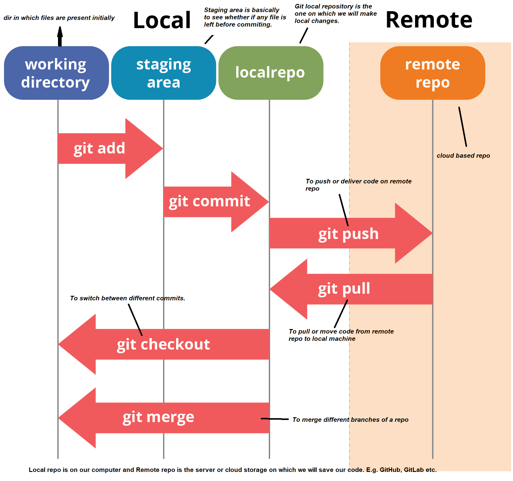

# What is git?
Git is a version control system. Means, you can revert back your changes made in a project.
# What is GitHub?
GitHub is basically a platform where you can push your Git code to collaborate with others and to save your code on cloud.
### Note that Git and Github are different things. They are just interconnected.
---

---
# Git Concept

# Some related setup
We have to first do some setup, so that we can use git with full functionality.
- `git --version` shows the version of git installed.
- `git config --global user.name <name>` can be used to set username for git.
- `git config --global user.email <email>` can be used to set email for git.
	- The above two things are done in order to log things who have made changes and when.
	- If you want to check whether the name/email has changed or not, or what name/email is currently set, you can do: `git config --global user.name` or `git config --global user.email` as per the needs.
	- One another method to change, set or see the name/email is by doing `git config --global --edit`. With this, vim editor will be opened and you can do any changes there.
		- To exit vim editor after doing the changes, press `Esc` and then type `:wq` which stands for 'write and quit' and then press `Enter`.
# Learning Git Commands
So, let's start to learn Git by knowing it's different commands.
- `git init` - to initialize git repo in local machine.
- `git status` - to check the status of the repo.
	- Tells what changes are made in the project.
	- You should keep running this command so that you know the status of your project in the current time.
- `git add <file>` - to add file to staging area.
	- `git add .` - to add all the files present in the directory to the staging area.
- `git commit -m <message for this commit>` - commits the files in the staging area with a certain message.
- `git log` - this prints the logs of all the commits made till that time in that branch.
- `git checkout <commit hash code/branch name>` - To switch between different commits.
	- You can do `git checkout <commit hash code>` to go to previous commits. You can also use this to come to the latest commit, or you can do:
	- `git checkout <branch name>` to come to the latest commit back (obviously, of that branch).
		- Or you can also mention name of other branches to switch between them.
- YOUR BRANCHES START WITH THE ==MAIN== BRANCH. YOU CAN CREATE INFINITE NO. OF BRANCHES INSIDE IT.
- `git branch <branch name>` - to create a new branch.
- `git branch` - to see all the branches.
- `git checkout -b <branch name>` - first you had to create a new branch and then checkout in it to work in it.
	- This option creates a branch and also checkouts in it at the same time.
- `git merge <branch name>` - to merge one branch to another.
	- Every branch doesn't know about any branch else itself. So, it is not holding any data even of it's child directory.
	- That's why we have to merge one branch to another so that contents of one branch go into another.
	- The concept of making multiple branches is so that other functionality of the project remains unaffected and we can work on our own project.
- `.gitignore` file - if you want some of your files to not be tracked by git, you can create a `.gitignore` file and mention the names of those files in it which you want not to be tracked by git.
	- Although, `.gitignore` file will be still be tracked by git. So, you can add `.gitignore` file in the same file so that it don't be tracked.
# Coming to GitHub
- **Concept of Origin** - Origin is basically a method by which you can tell your local git repo where to push your code or where is your remote repo located.
- `git remote -v` - tells your fetch or push location.
- `git remote add origin <link>` - This code will be given by GitHub when you will create a repo.
	- NOTE: While using git, this may not work. So, you have to set up SSH and work with that. I think you HAVE TO use it if you are using Git Bash (You can watch a video by Code With Harry on how to do that. [This is the video](https://youtu.be/_eYJyRK-yaY))
- Other commands will be given by GitHub too :)
- `git push` - this command can be used to push code on GitHub after making changes to the project.
	- You have to specify origin already in order to push with this command. Or you can also specify it in the command.
	- `git push origin` will push changes from all local branches to matching branches the origin remote. `git push origin master` will push changes from the local master branch to the remote master branch.
- You can checkout to a specific branch and then do `git push -u origin <branch name>` to push it to GitHub.
- `git clone <repo URL>` - clones the specific repo to local machine.